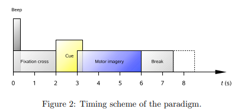

# EEG Motor Imagery Deep Learning

[English](README.md) [中文](README.zh_CN.md)

A research repository of deep learning on electroencephalographic (EEG) for Motor imagery(MI), including eeg data
processing(visualization & analysis), papers(research and summary), deep learning models(reproduction and experiments).

The experiments in this repository are based on <a href="https://github.com/mne-tools/mne-python">MNE-Python</a>, 
<a href="https://github.com/NeuroTechX/moabb">Moabb</a>,
<a href="https://github.com/braindecode/braindecode">Braindecode</a> and 
<a href="https://github.com/skorch-dev/skorch">Skorch</a>.

You can find more contents of this repository through the following sections:

- [Paper Researching](#field-researching)
- [EEG Data Analysis and Processing](#eeg-data-analysis-and-processing)
- [Experiments](#experiments)

## Field Researching

Field Researching currently includes the following papers and datasets:

- [Awesome Papers](#awesome-papers)
- [Public Datasets](#public-datasets)

### Awesome Papers


2017 Schirrmeister et al.
<u><i>Deep learning with convolutional neural networks for EEG decoding and visualization</i></u>
[<a href="https://onlinelibrary.wiley.com/doi/10.1002/hbm.23730"><b>paper link</b></a>]
[<a href="https://github.com/robintibor/braindecode"><b>source code</b></a>]
[<a href="https://github.com/robintibor/braindecode"><b>reproduce1</b></a>]

2018 Lawhern et al.
<u><i>EEGNet: a compact convolutional neural network for EEG-based brain–computer interfaces</i></u>
[<a href="https://iopscience.iop.org/article/10.1088/1741-2552/aace8c"><b>paper link</b></a>]
[<a href="https://github.com/vlawhern/arl-eegmodels"><b>source code</b></a>]
[<a href="https://github.com/braindecode/braindecode/tree/master/braindecode/models"><b>reproduce1</b></a>]
[<a href="https://colab.research.google.com/drive/1ANF8PwvtUPawTeQt4Uu4iwscpyhHBgvM"><b>reproduce2</b></a>]

2018 Sakhavi et al.
<u><i>Learning Temporal Information for Brain-Computer Interface Using Convolutional Neural Networks</i></u>
[<a href="https://ieeexplore.ieee.org/document/8310961"><b>paper link</b></a>]

2019 Dose et al.
<u><i>An end-to-end deep learning approach to MI-EEG signal classification for BCIs</i></u>
[<a href="https://www.sciencedirect.com/science/article/abs/pii/S0957417418305359"><b>paper link</b></a>]
[<a href="https://github.com/hauke-d/cnn-eeg"><b>source code</b></a>]

2020 Wang et al.
<u><i>An Accurate EEGNet-based Motor-Imagery Brain Computer Interface for Low-Power Edge Computing</i></u>
[<a href="https://ieeexplore.ieee.org/document/9137134"><b>paper link</b></a>]
[<a href="https://github.com/MHersche/eegnet-based-embedded-bci"><b>source code</b></a>]

2020 Ingolfsson et al.
<u><i>EEG-TCNet: An Accurate Temporal Convolutional Network for Embedded Motor-Imagery Brain-Machine Interfaces</i></u>
[<a href="https://ieeexplore.ieee.org/document/9283028"><b>paper link</b></a>]
[<a href="https://github.com/iis-eth-zurich/eeg-tcnet"><b>source code</b></a>]
[<a href="https://github.com/okbalefthanded/eeg-tcnet/blob/master/eeg_tcnet_colab.ipynb"><b>reproduce1</b></a>]

2021 Mane et al.
<u><i>A Multi-view CNN with Novel Variance Layer for Motor Imagery Brain Computer Interface</i></u>
[<a href="https://ieeexplore.ieee.org/document/9175874"><b>paper link</b></a>]
[<a href="https://github.com/ravikiran-mane/FBCNet"><b>source code</b></a>]

2022 Hamdi Altaheri et al.
<u><i>Physics-Informed Attention Temporal Convolutional Network for EEG-Based Motor Imagery Classification</i></u>
[<a href="https://ieeexplore.ieee.org/document/9852687"><b>paper link</b></a>]
[<a href="https://github.com/Altaheri/EEG-ATCNet"><b>source code</b></a>]


### Public Datasets

List of the most frequently used public datasets in the papers

- BCI IV 2a([BCI Competition IV](https://www.bbci.de/competition/iv/))

Dataset description: [BCI Competition 2008 – Graz data set A](https://www.bbci.de/competition/iv/desc_2a.pdf) 4 classes

Download link: [.gdf format](https://www.bbci.de/competition/iv/#dataset2a)
or [.mat format](http://bnci-horizon-2020.eu/database/data-sets)



- Physionet([Physionet Dataset](https://physionet.org/content/eegmmidb/1.0.0/))

Dataset description: [Physionet Database EEG Motor Movement/Imagery Dataset](https://physionet.org/content/eegmmidb/1.0.0/) 2/3/4 classes

Download link: [.edf format](https://physionet.org/content/eegmmidb/1.0.0/)

 [[Image reference](https://www.sciencedirect.com/science/article/abs/pii/S0957417418305359)]

*For deep learning experiments, to easier downloading of datasets and faster data processing, it is recommended to
use [Moabb dataset](http://moabb.neurotechx.com/docs/datasets.html#module-moabb.datasets)
or [Braindecode dataset](https://braindecode.org/stable/generated/braindecode.datasets.BNCI2014001.html) to do
experiments.*

## EEG Data Analysis and Processing

- Data Load and Analysis

Using MNE-Python library with Jupyter Notebook to analyze demo EEG data of [BCI IV 2a](#public-datasets), including
loading data, plotting signal, extracting events...

For details and code, please move
to [data_load_visualization.ipynb](./data_analysis_notebook_mne/data_load_visualization.ipynb), for more examples,
to [MNE-Python tutorials](https://mne.tools/stable/auto_tutorials/index.html).

- Data Processing

Using MNE-Python library with Jupyter Notebook to process demo EEG data of [BCI IV 2a](#public-datasets), including
filtering, resampling, segmenting data ...

For details and code, please move to [data_processing.ipynb](./data_analysis_notebook_mne/data_processing.ipynb), for
more examples, to [MNE-Python tutorials](https://mne.tools/stable/auto_tutorials/index.html).

## Experiments

This repo is based on `Python 3.10`. And before you run experiments of this repo, install the environment first:

```shell
$ pip install -r requirements.txt
```

Then you can use `-h` to get usage:
```shell
$ python .\main.py -h
```
```
usage: main.py [-h] [--dataset {bci2a,physionet}] [--model {EEGNet,EEGConformer,ATCNet,EEGInception,EEGITNet}] [--config CONFIG] [--strategy {cross-subject,within-subject}] [--save]

optional arguments:
  -h, --help            show this help message and exit
  --dataset {bci2a,physionet}
                        data set used of the experiments
  --model {EEGNet,EEGConformer,ATCNet,EEGInception,EEGITNet}
                        model used of the experiments
  --config CONFIG       config file name(.yaml format)
  --strategy {cross-subject,within-subject}
                        experiments strategy on subjects
  --save                save the pytorch model and history (follow skorch)
```

If you run experiments on dataset `BCI 2a` dataset, using `EEGNet` model, simply run:

```shell
$ python .\main.py --dataset bci2a --model EEGNet
```

It will use the default config in [bci2a_EEGNet_default.yaml](./config/bci2a_EEGNet_default.yaml) and default `within-subject` strategy  , surely you can use `--config` to specify.Then you can get the output accuracy and `result.log` in `./save` folder:

```
[2024-07-30 17:30:51] Subject1 test accuracy: 70.4861%
[2024-07-30 17:32:17] Subject2 test accuracy: 53.8194%
[2024-07-30 17:33:40] Subject3 test accuracy: 79.1667%
[2024-07-30 17:35:02] Subject4 test accuracy: 62.8472%
[2024-07-30 17:36:24] Subject5 test accuracy: 68.4028%
[2024-07-30 17:39:13] Subject6 test accuracy: 50.6944%
[2024-07-30 17:40:35] Subject7 test accuracy: 72.2222%
[2024-07-30 17:42:00] Subject8 test accuracy: 64.5833%
[2024-07-30 17:43:23] Subject9 test accuracy: 70.1389%
[2024-07-30 17:43:23] Average test accuracy: 65.8179%
```

If you run experiments on dataset `Physionet` dataset, using `cross-subject` strategy:

```shell
python .\main.py --dataset physionet --model EEGNet --strategy cross-subject
```

**You can also modify the config yaml file to adjust parameter or make your own models to do experiments.** 
